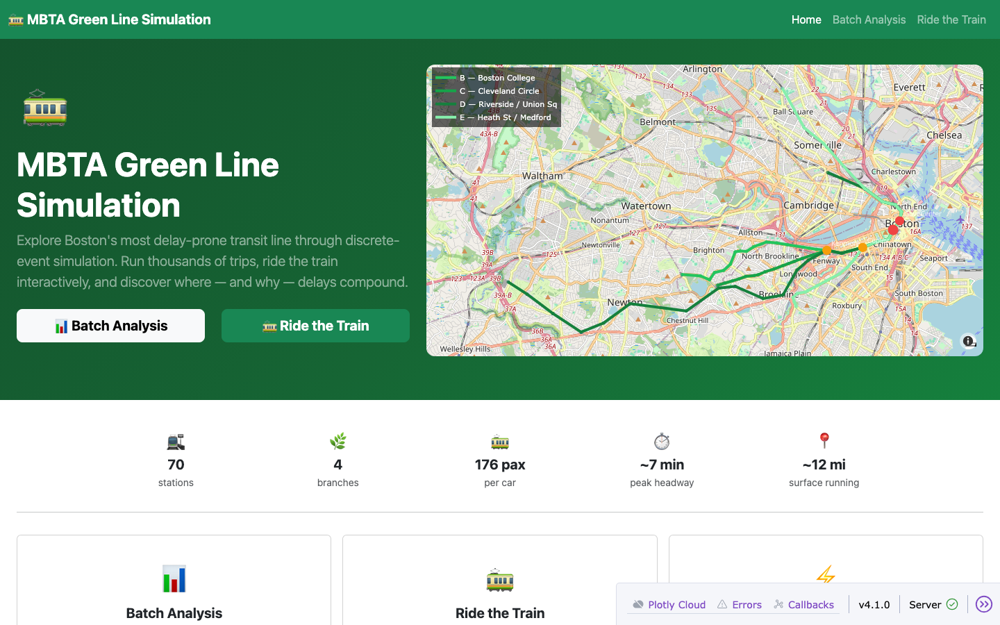
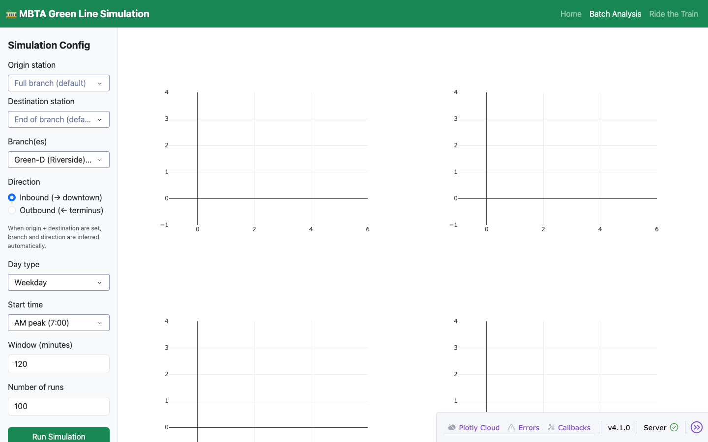
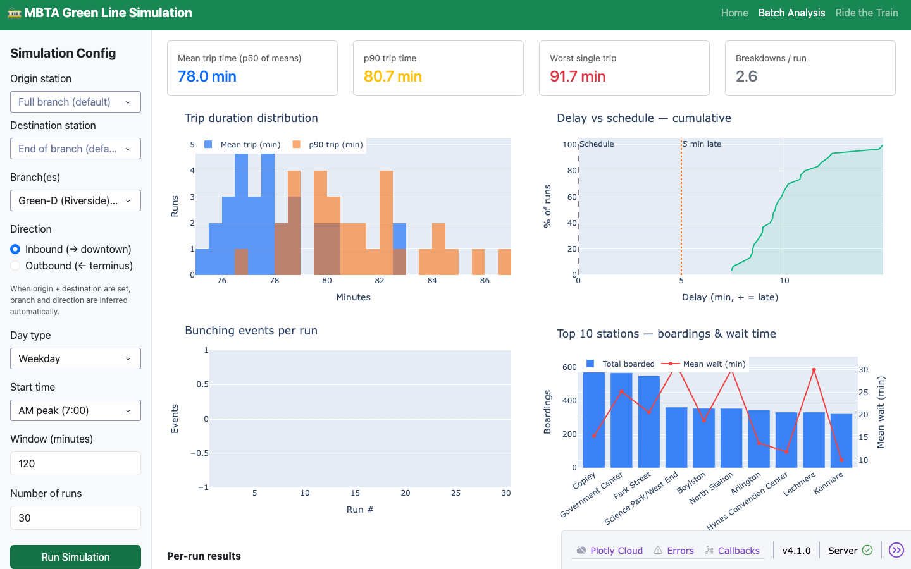
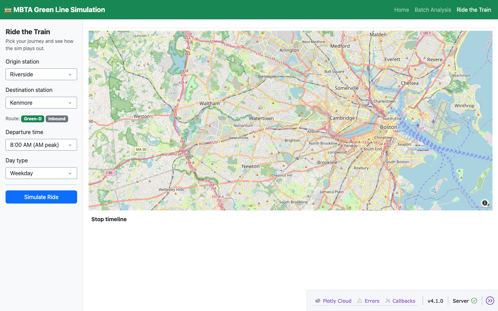
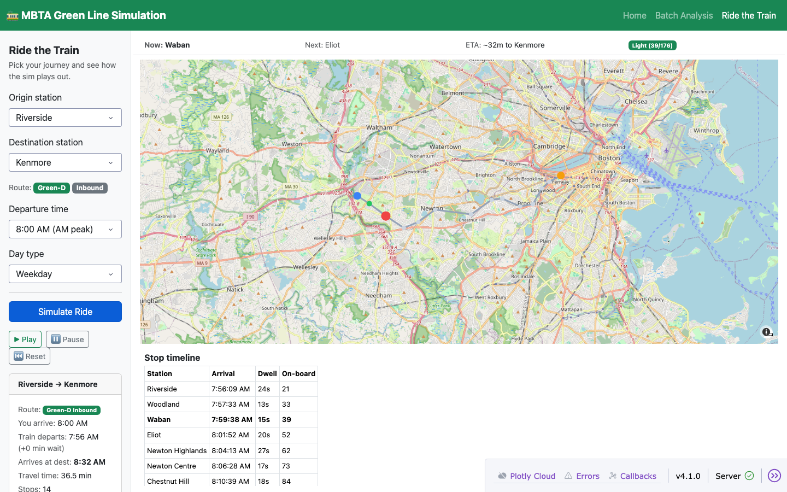
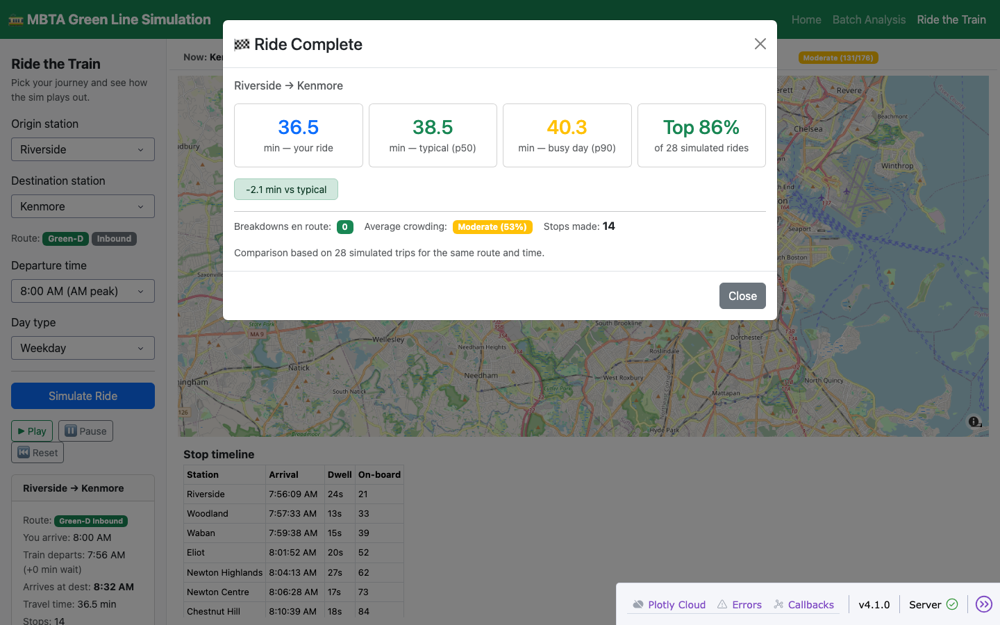

# MBTA Green Line Simulation

A discrete-event simulation of the MBTA Green Line — the most delay-prone transit line in Boston — built with **SimPy** and visualised through an interactive **Dash** dashboard.

The Green Line runs four branches (B, C, D, E) that merge into a shared underground trunk, creating cascading delays from bunching, dwell-time variance, and surface-street interference. This project models those dynamics, fits distributions from real MBTA GTFS data, and lets you explore the results interactively.

---

## Live demo

**[mbta-green-line-sim-damp-pine-9794.fly.dev](https://mbta-green-line-sim-damp-pine-9794.fly.dev)**

> Free tier — may take ~20 s to wake from sleep on first visit.

---

## Screenshots

### Landing page


### Batch Analysis — empty state


### Batch Analysis — results


### Ride the Train — ready


### Ride the Train — mid-animation


### Ride the Train — end-of-ride stats


---

## Features

| Feature | Description |
|---------|-------------|
| **Batch Analysis** | Run up to 1 000+ simulations; explore delay distributions, expected vs actual travel time, bunching frequency, and per-station boarding/wait stats |
| **Ride the Train** | Pick an origin, destination, and departure time — watch your train move stop-by-stop on a live OpenStreetMap; see how your trip compares to the p50 / p90 across 30 simulated runs |
| **Real network topology** | 70 stations across all four branches + GLX extension, correct merge points at Kenmore and Copley |
| **GTFS-fitted distributions** | Headways, dwell times, travel times, and passenger arrival rates fitted from real MBTA schedule data |

---

## Setup

```bash
git clone https://github.com/boonin123/mbta-green-line-sim.git
cd mbta-green-line-sim

python -m venv venv
source venv/bin/activate        # Windows: venv\Scripts\activate
pip install -r requirements.txt
```

Optional — add an MBTA API key for real-time data:
```bash
cp .env.example .env
# edit .env and set MBTA_API_KEY=your_key_here
```

## Running locally

```bash
python dashboard/app.py
# → http://localhost:8050
```

## CLI usage

```bash
# Single run — D branch inbound, weekday AM peak
python -m sim.runner --mode single --branch Green-D --direction 1 --day weekday --start-time 07:00 --duration 120

# Batch run — 1 000 simulations
python -m sim.runner --mode batch --branch Green-D --direction 1 --day weekday --start-time 07:00 --duration 120 --runs 1000
```

## Tests

```bash
pytest tests/ -v   # 95 tests
```

---

## Project structure

```
mbta-green-line-sim/
├── data/
│   ├── gtfs/                    # Raw MBTA GTFS files
│   ├── distributions/           # Fitted JSON distributions
│   └── stations.json            # 70 stations — name, coords, branch, surface flag
├── sim/
│   ├── network.py               # Green Line graph + segment distributions
│   ├── train.py                 # SimPy Train process
│   ├── station.py               # Platform queue + boarding/alighting
│   ├── passenger.py             # Poisson arrival process
│   └── runner.py                # single_run / batch_run entry points
├── analysis/
│   └── metrics.py               # Delay, bunching, throughput stats
├── dashboard/
│   ├── app.py                   # Dash entry point (exposes `server` for gunicorn)
│   ├── landing_view.py          # Home page
│   ├── batch_view.py            # Batch I/O analysis
│   └── map_view.py              # Animated single-run map
├── tests/                       # 95 pytest tests
├── fly.toml                     # Fly.io deployment config
└── requirements.txt
```

---

## Tech stack

| Layer | Technology |
|-------|-----------|
| Simulation | Python + SimPy (discrete-event) |
| Dashboard | Dash 4 + Dash Bootstrap Components |
| Maps | Plotly Scattermapbox + OpenStreetMap (no API key required) |
| Data | MBTA GTFS + V3 API |
| Production server | Gunicorn |

---

## Data sources

- [MBTA GTFS](https://www.mbta.com/developers/gtfs) — scheduled times, stop coordinates, route topology
- [MBTA V3 API](https://api-v3.mbta.com) — real-time predictions (optional; used for distribution fitting)
- [MBTA Blue Book](https://www.mbta.com/performance-and-oversight) — historical ridership and on-time performance
